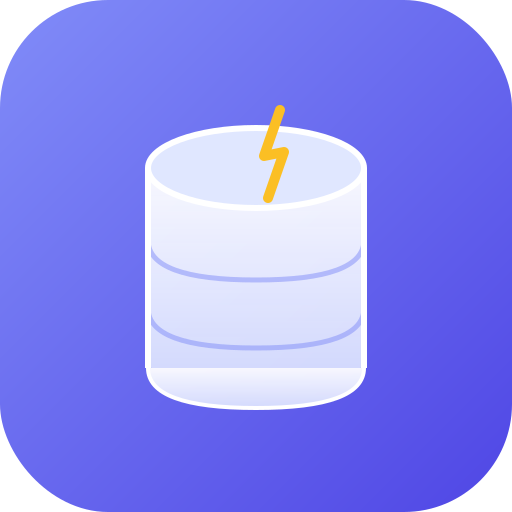
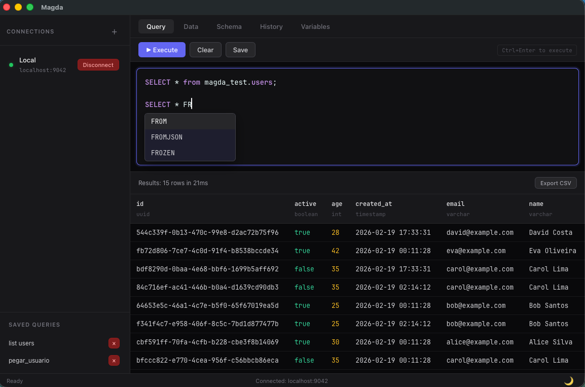
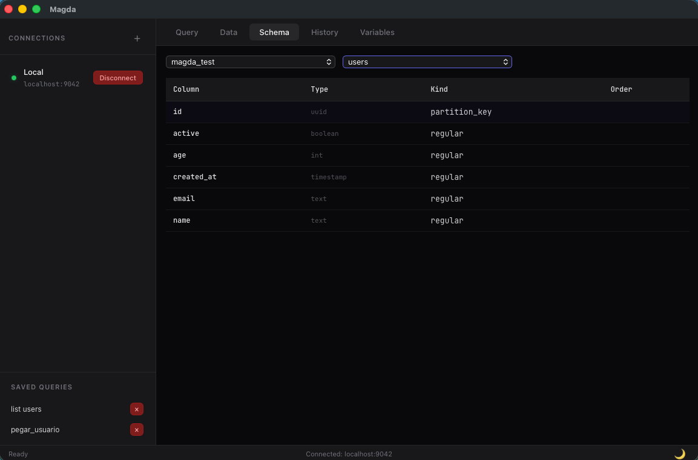
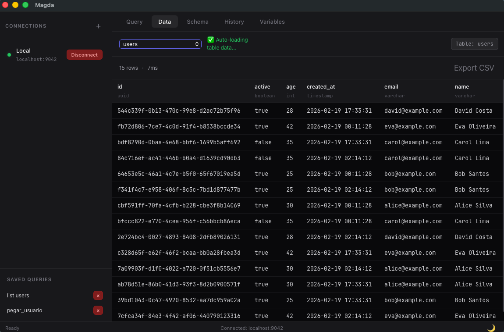
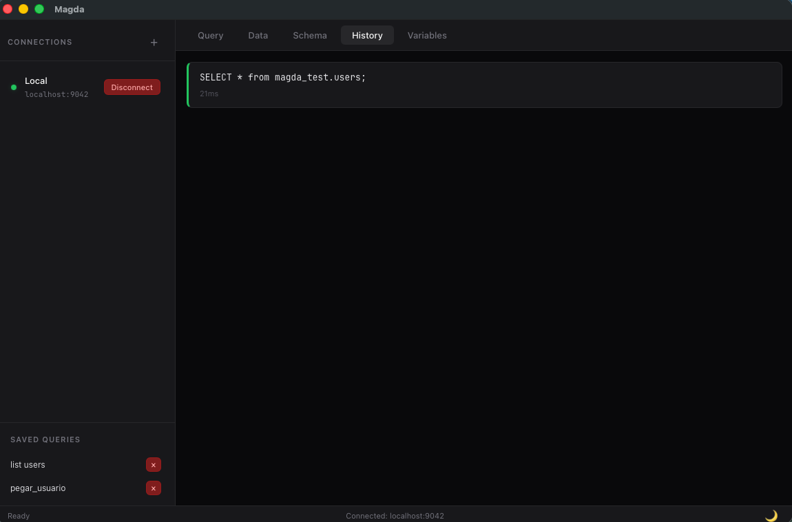
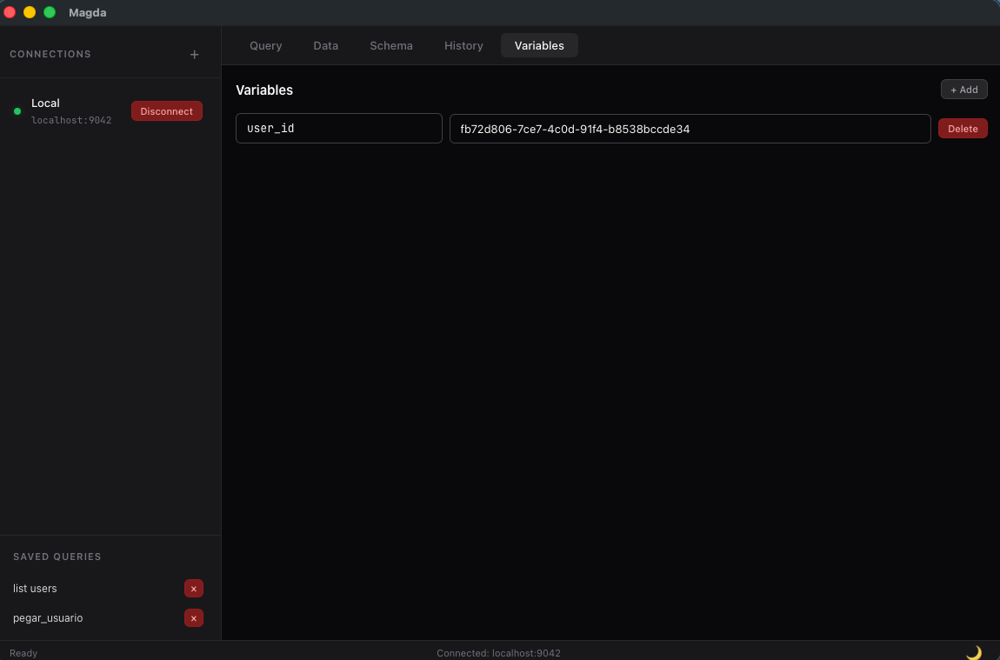

<div align="center">



# Magda

**Finally, a Cassandra client that doesn't get in your way.**

A native desktop client for Apache Cassandra — built entirely in Rust.
Zero browser overhead. Instant startup. Open source.

[](https://www.rust-lang.org/)
[](https://dioxuslabs.com/)
[](LICENSE)
[](https://github.com/sidneip/magda/releases)

[Download](#download) &bull; [Features](#features) &bull; [Roadmap](#roadmap) &bull; [Contributing](#contributing)

</div>

---

<p align="center">
  
</p>

## Why Magda?

If you work with Cassandra, you know the pain:

- **cqlsh** is powerful but has no GUI, no autocomplete, no visual feedback
- **DataStax Studio** is browser-based, heavy, and requires a running server
- **DBeaver** is generic — it doesn't understand CQL nuances

Magda is different. It's a **native desktop app** purpose-built for Cassandra developers:

| | cqlsh | DataStax Studio | DBeaver | **Magda** |
|---|:---:|:---:|:---:|:---:|
| Native performance | - | - | - | **Yes** |
| CQL syntax highlighting | - | Yes | Partial | **Yes** |
| Schema-aware autocomplete | - | Yes | Partial | **Yes** |
| Lightweight (< 50 MB) | Yes | - | - | **Yes** |
| Instant startup | Yes | - | - | **Yes** |
| No server required | Yes | - | Yes | **Yes** |
| Open source | Yes | - | Yes | **Yes** |
| Query variables | - | - | - | **Yes** |
| Multiple connections | - | Yes | Yes | **Yes** |

## Features

### CQL Editor with Syntax Highlighting & Autocomplete

Write CQL with confidence — keywords, types, functions, strings, and `{{variables}}` are all color-coded. Autocomplete suggests CQL keywords as you type, and knows your table names after `FROM`.

<p align="center">
  
</p>

### Schema Browser

Explore keyspaces, tables, column types, partition keys, and clustering order — all in one view.

<p align="center">
  
</p>

### Data Browser with Pagination

Browse table data with automatic pagination. Export results to CSV with one click.

<p align="center">
  
</p>

### Query History & Saved Queries

Every query is logged with execution time. Save your most-used queries as reusable snippets in the sidebar.

<p align="center">
  
</p>

### Query Variables

Define reusable `{{variables}}` that get substituted into your queries. Perfect for parameterized testing.

<p align="center">
  
</p>

### Multiple Connections

Manage and switch between multiple Cassandra clusters. Each connection is persisted across sessions.

## Download

Pre-built binaries for each release are available on the [Releases page](https://github.com/sidneip/magda/releases).

| Platform | Download |
|---|---|
| macOS (Apple Silicon) | `magda-macos-aarch64.dmg` |
| Linux (x86_64) | `magda-linux-x86_64.deb` |
| Windows (x86_64) | `magda-windows-x86_64-setup.exe` |

### Build from source

```bash
# Prerequisites: Rust toolchain + Dioxus CLI
cargo install dioxus-cli

# Run in development mode
cd desktop && dx serve

# Build release
cd desktop && dx build --desktop --release
```

## Roadmap

### Done

- [x] CQL syntax highlighting
- [x] Schema-aware query autocomplete
- [x] Multiple connection management
- [x] Schema browser (keyspaces, tables, columns)
- [x] Data browser with pagination
- [x] Query history with execution times
- [x] Saved queries / snippets
- [x] Query variables (`{{var}}` substitution)
- [x] Export results to CSV
- [x] Persistent config (connections, variables, queries)
- [x] Cross-platform (macOS, Linux, Windows)

### Next Up

- [ ] Export results to JSON
- [ ] Light theme
- [ ] Connection import / export
- [ ] CSV / JSON data import with validation
- [ ] Edit table data directly in the grid
- [ ] Query templates for common CQL patterns

### Future Vision

- [ ] **Query Performance Analyzer** — execution time, tombstones, nodes touched, optimization suggestions
- [ ] **Smart Schema Designer** — real-time validation, anti-pattern detection (wide partitions, hotspots)
- [ ] **Cluster Health Dashboard** — node status, heap usage, compaction, network topology
- [ ] **Data Migration Tools** — batch operations, schema comparison between clusters
- [ ] **Visual Query Builder** — drag-and-drop query construction
- [ ] **Query Explainer** — why a query is slow, which nodes are impacted, how to optimize

## Architecture

Built with [Dioxus](https://dioxuslabs.com/) (Rust UI framework) and [cdrs-tokio](https://github.com/krojew/cdrs-tokio) (pure Rust Cassandra driver). No Electron. No JVM. No C dependencies.

```
magda/
├── desktop/              # Desktop app (Dioxus + cdrs-tokio)
│   ├── assets/           # CSS, icons
│   └── src/
│       ├── main.rs               # App entry + window config
│       ├── state.rs              # Global state (Dioxus Signals)
│       ├── cassandra.rs          # CQL driver integration
│       ├── cql_tokenizer.rs      # Syntax highlighting + autocomplete engine
│       ├── connection/           # Multi-connection manager
│       ├── config.rs             # Persistent user preferences (TOML)
│       └── components/           # UI components
├── web/                  # Web target (planned)
├── mobile/               # Mobile target (planned)
└── ui/                   # Shared UI components
```

## Contributing

Magda is open source and contributions are welcome! Whether it's a bug fix, new feature, or documentation improvement — every PR helps.

```bash
# Clone and run
git clone https://github.com/sidneip/magda.git
cd magda/desktop
dx serve
```

Check the [Roadmap](#roadmap) for ideas on what to work on, or open an issue to discuss your idea first.

## License

MIT
